<h1 align="center"> Material GNOME </h3>

<p align="center">
  <a href="https://github.com/SakibShahariar/material-gnome-theme/stargazers">
    
  </a>
  <a href="https://github.com/SakibShahariar/material-gnome-theme/issues">
    
  </a>
  <a href="https://github.com/SakibShahariar/material-gnome-theme/graphs/contributors">
    
  </a>
</p>

A modern, cohesive theme for the GNOME desktop environment inspired by Google's Material You and Material 3 design languages. It provides a unified visual experience across GTK3, GTK4, and GNOME Shell with a focus on deep container colors, expressive active states, and minimal visual clutter.

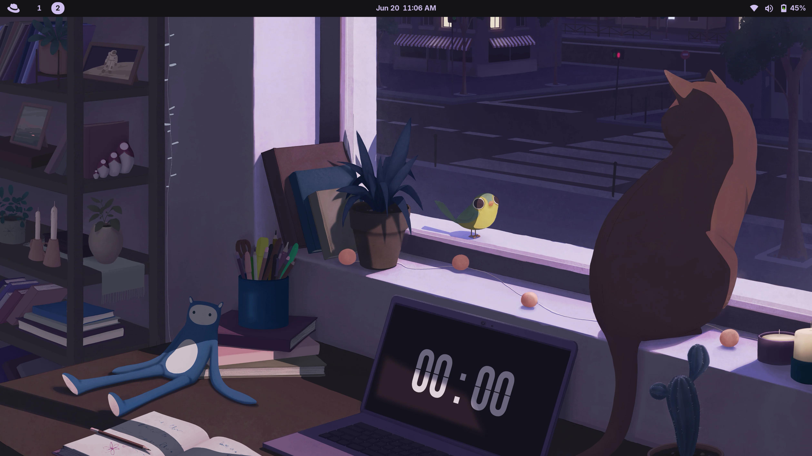

---

## 🖼️ Screenshots

| App Grid | Quick Settings |
|---|---|
| 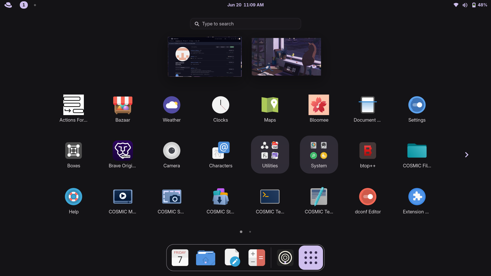 | 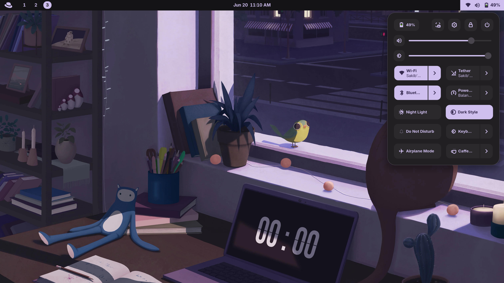 |

| Notifications | Activities Overview |
|---|---|
| 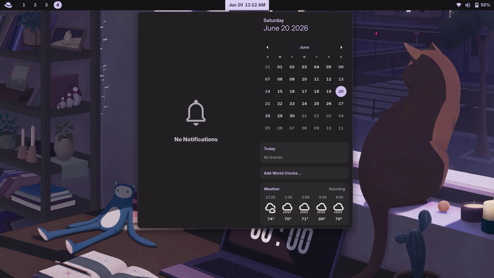 | 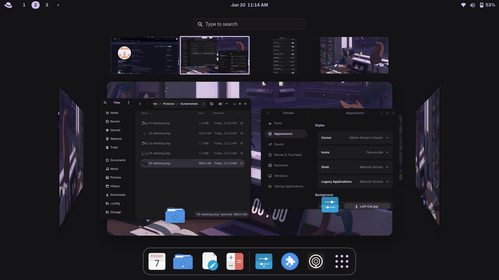 |

| GTK4 App | GTK3 App |
|---|---|
| 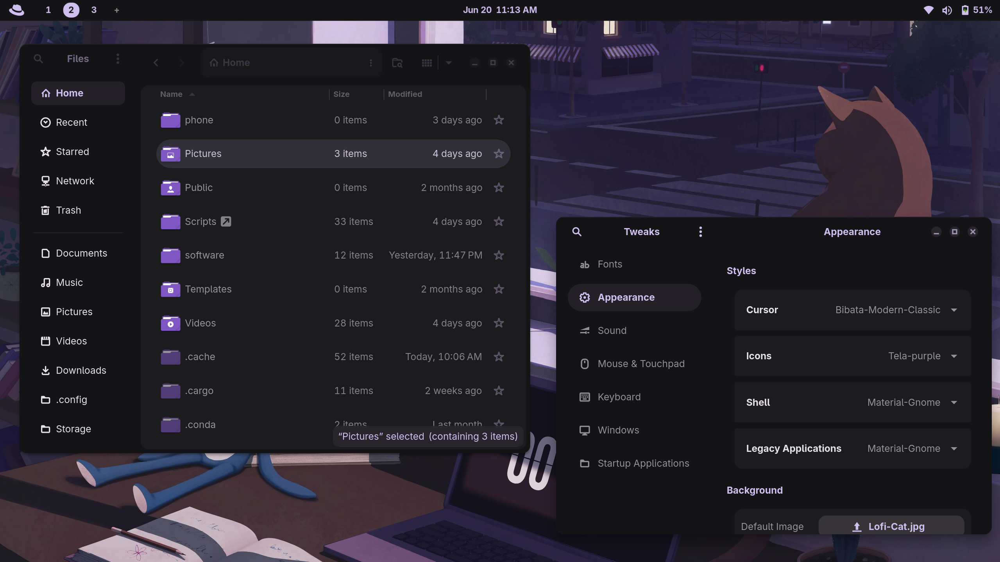 | 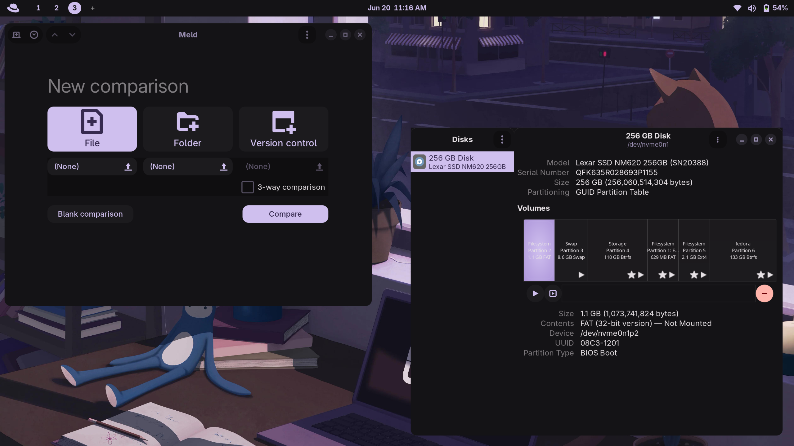 |

---

## 📂 Repository Structure

```text
Material-Gnome/
├── gtk-3.0/         # GTK3 Stylesheet & Assets
├── gtk-4.0/         # GTK4 & Libadwaita Stylesheet
├── gnome-shell/     # GNOME Shell Desktop Theme
│   └── layouts/     # Swappable top bar layout styles
├── themes/          # Premade color themes (applied via Matugen)
└── index.theme      # Desktop Theme Metadata
```

---

## ✨ Features

* **True System-Wide Consistency:** Unified styling across legacy GTK3 apps, modern GTK4/Libadwaita apps, and the GNOME Shell interface.
* **Material 3 Container Architecture:** Styled with container shapes, adaptive active states, and expressive focus indicators (like the segmented view-switcher design).
* **Self-Contained Color System:** Colors are declared natively per toolkit—making the theme independent, lightweight, and incredibly easy to modify without external dependencies.
* **Dynamic-Ready (Optional):** Completely compatible with color-generation backends like `matugen` or `gradience`.
* **Dark-First Design:** Optimized specifically for modern dark-mode workflows to minimize eye strain.
* **Swappable Top Bar Layouts:** Multiple GNOME Shell top bar styles included — pill, capsule, segmented, unified, and more — so you can pick the look that fits you best.
* **Premade Color Themes:** A set of ready-made color themes is included in `themes/` (JSON color tokens) — apply one by copying values into `colors.css`, no extra tools required.

---

## 🚀 Installation

### 1. Deploy the Theme Files

Clone or extract the theme directory to your local or system themes folder:

**Local User Deployment (Recommended):**

```bash
mkdir -p ~/.themes
cp -r Material-Gnome ~/.themes/
```

**System-Wide Deployment:**

```bash
sudo cp -r Material-Gnome /usr/share/themes/
```

### 2. Enable GNOME Shell Theme Support

GNOME Shell requires the **User Themes** extension to load custom desktop stylesheets.

* **Fedora/RHEL:** `sudo dnf install gnome-tweaks gnome-extensions-app gnome-shell-extension-user-theme`
* **Ubuntu/Debian:** `sudo apt install gnome-tweaks gnome-shell-extension-manager gnome-shell-extension-user-theme`
* **Arch Linux:** `sudo pacman -S gnome-tweaks gnome-shell-extensions`

> 💡 **Note:** Open your system **Extensions** application and ensure the **User Themes** extension is toggled **ON**.

### 3. Apply the Theme

#### GTK3 & GNOME Shell

Open **GNOME Tweaks** and navigate to the **Appearance** tab:

* Set **Legacy Applications** (or Applications) to `Material GNOME`.
* Set **Shell** to `Material GNOME`.

#### GTK4 / Libadwaita Applications

Modern Libadwaita apps look into your local user configuration instead of `~/.themes`. To force GTK4 apps to follow your theme, symlink the files into your local configuration directory:

```bash
mkdir -p ~/.config/gtk-4.0
ln -sf ~/.themes/Material-Gnome/gtk-4.0/gtk.css ~/.config/gtk-4.0/gtk.css
ln -sf ~/.themes/Material-Gnome/gtk-4.0/gtk-dark.css ~/.config/gtk-4.0/gtk-dark.css
```

### Optional: Manager App

If you prefer a GUI workflow, [Material GNOME Manager](https://github.com/AdityaHebballe/Material-Gnome-Manager) is a community GTK4/Libadwaita app that can fetch and update the theme, install it locally, apply color presets, generate Matugen palettes, and link GTK4/Libadwaita files automatically.

On Arch Linux, it is also available from the AUR:

```bash
yay -S material-gnome-manager-git
```

---

## 📦 Flatpak Application Support

Flatpak applications run in isolated sandboxes and cannot access your local theme directories by default. To make them follow your theme, run the following commands:

1. **Grant filesystem permission:**

```bash
flatpak override --user --filesystem=$HOME/.themes:ro
```

2. **Force the theme environment variable:**

```bash
flatpak override --user --env=GTK_THEME=Material-Gnome
```

---

## 🎨 Color Themes

The `themes/` folder contains a set of premade color themes as JSON files (Material You–style color tokens). A few examples:

| Aqua Abyss | Arctic Blood | Forgotten Atelier |
|---|---|---|
| 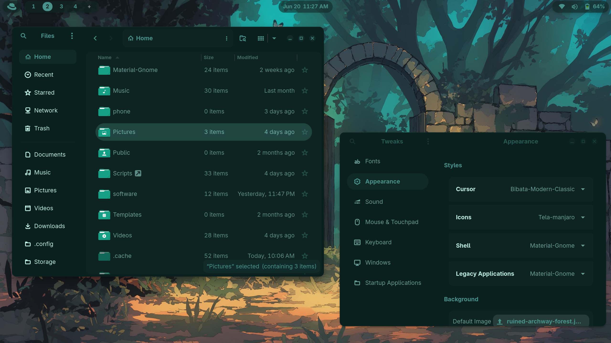 | 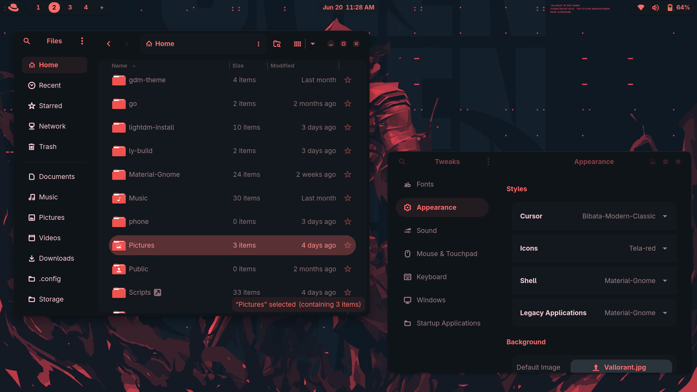 |  |

| Desert Stone | Jade Vineyard |
|---|---|
| 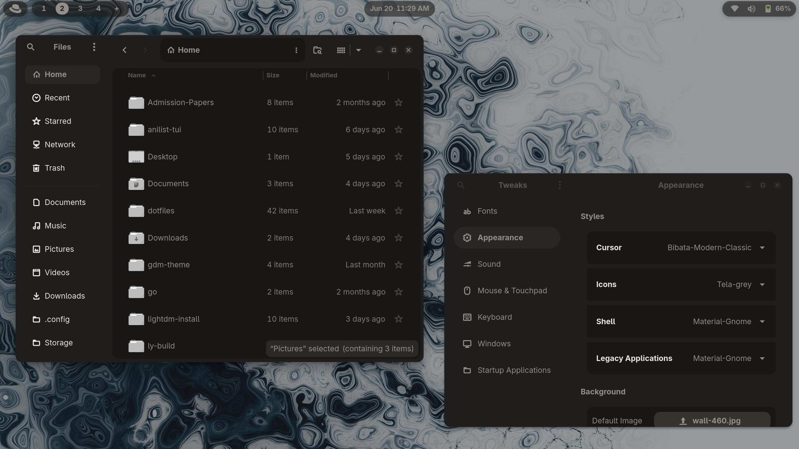 |  |

There are two ways to apply one:

### Option A: Manual swap

Copy each value from the theme JSON into the matching CSS custom property in `colors.css`.

**Mapping example:**

| JSON key (`themes/*.json`) | CSS variable (`colors.css`) |
|---|---|
| `colors.primary.default.color` | `--primary` |
| `colors.on_primary.default.color` | `--on_primary` |
| `colors.primary_container.default.color` | `--primary_container` |
| `colors.surface.default.color` | `--surface` |
| `colors.on_surface.default.color` | `--on_surface` |
| ... | ... |

Every key in the JSON has a matching `--variable` in `colors.css` with the same name — just take the hex value from `"color"` and paste it in.

1. Open your chosen theme file in `themes/`.
2. Open the `colors.css` files you want to update:
   - `gtk-3.0/colors.css`
   - `gtk-4.0/colors.css`
   - `gnome-shell/gnome-shell-template.css`
3. For each `:root` variable, replace the hex value with the matching value from the JSON file (e.g. `--primary: #5c9be4;` from `colors.primary.default.color`).
4. Save, then reload your GTK apps and GNOME Shell to see the new colors.

### Option B: Matugen

[`matugen`](https://github.com/InioX/matugen) is the theme's primary intended color workflow. It can generate a palette from a wallpaper or source color, and it also supports importing a JSON file directly and using its values inside templates — so it can take the same files in `themes/` and output the `colors.css` files for you automatically, no manual copy-pasting required.

---

## 🎨 Top Bar Layouts

GNOME Shell's top bar can be swapped between several included styles. A few examples:

| Floating Capsule | Floating Capsule (Glass) |
|---|---|
| 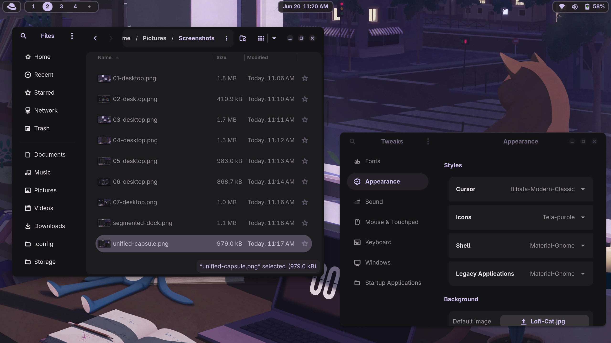 | 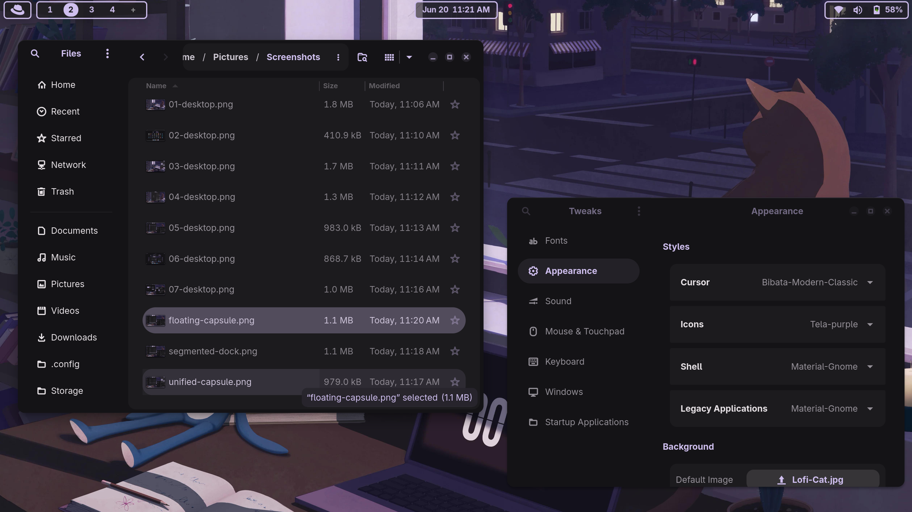 |

| Pill Duo | Unified Capsule | Segmented Dock |
|---|---|---|
| 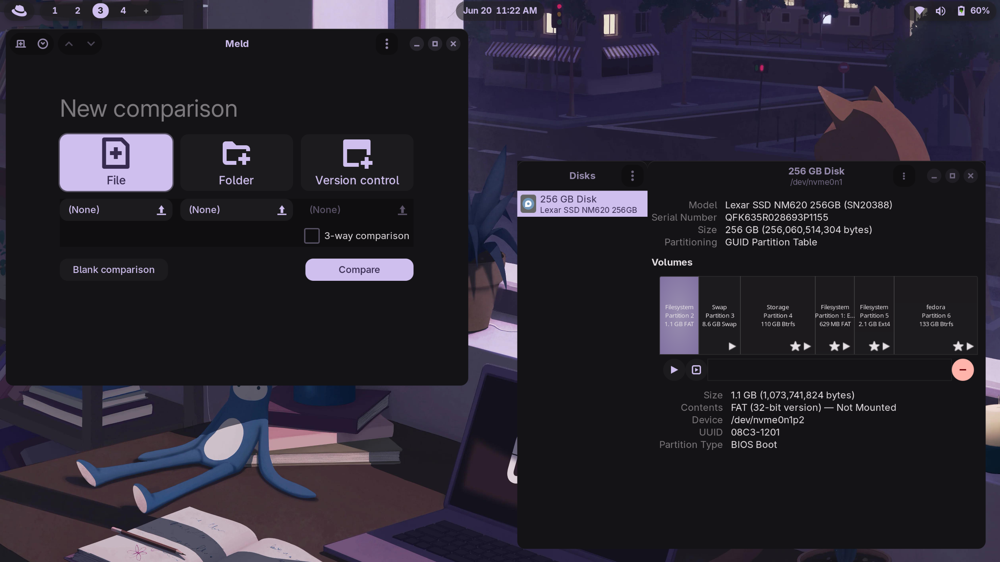 | 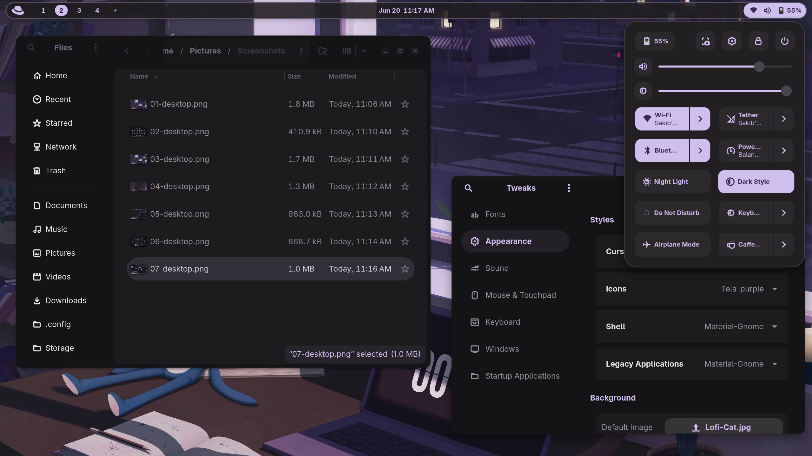 | 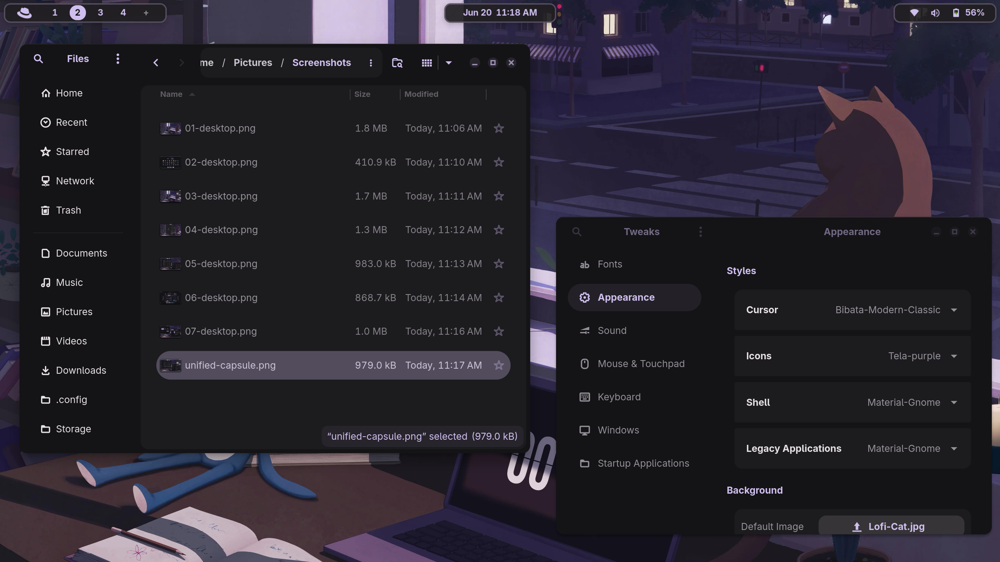 |

Each layout lives as a separate CSS file in `gnome-shell/layouts/`:

```text
gnome-shell/layouts/
├── default.css
├── default-transparecy.css
├── active-layout.css
├── floating-capsule.css
├── floating-capsule-glass.css
├── pill-duo.css
├── segmented-dock.css
├── segmented-pill.css
├── structured-box.css
├── unified-bar.css
├── unified-border.css
├── unified-capsule.css
├── unified-capsule-bottom.css
└── unified-pill.css
```

**To apply a layout:**

1. Open `gnome-shell/gnome-shell.css` and locate the top bar section.
2. Open your chosen layout file from `gnome-shell/layouts/` (e.g. `unified-pill.css`).
3. Replace the existing top bar block in `gnome-shell.css` with the contents of the layout file.

---

## 🎬 Reducing Animations

The theme includes expressive `@keyframes` animations (used for elements like active-state transitions). If you prefer a calmer, more static look, you can disable them:

1. Open `gnome-shell/gnome-shell.css`.
2. Find the `@keyframes` declarations near the top of the file.
3. Comment them out:

```css
/*
@keyframes example-animation {
  ...
}
*/
```

This removes the expressive motion while keeping all colors and layout intact.

---

## 🛠️ Configuration & Tweaks

If you want to tweak or override specific elements (like changing the accent colors), you can modify the primary palette definitions found at the top of the respective stylesheets:

* **GTK3:** `gtk-3.0/colors.css`
* **GTK4/Libadwaita:** `gtk-4.0/colors.css`
* **GNOME Shell:** `gnome-shell/gnome-shell-template.css`

---

## 🙏 Acknowledgements

This project builds on base files from these excellent theme repos by [Fausto-Korpsvart](https://github.com/Fausto-Korpsvart) — credit to the original author:

* [Gruvbox-GTK-Theme](https://github.com/Fausto-Korpsvart/Gruvbox-GTK-Theme)
* [Tokyonight-GTK-Theme](https://github.com/Fausto-Korpsvart/Tokyonight-GTK-Theme)

Both are licensed under GPL-3.0, same as this project.

---

## 🐛 Feedback & Bug Reports

If you run into any bugs, visual glitches, or have suggestions, please [open an issue](../../issues) — feedback is always welcome and helps improve the theme for everyone.

---

## 📜 License

This project is licensed under the **GPL-3.0 License** - see the [LICENSE](LICENSE) file for details.

## Star History
[](https://star-history.com/#SakibShahariar/material-gnome-theme&Date)
